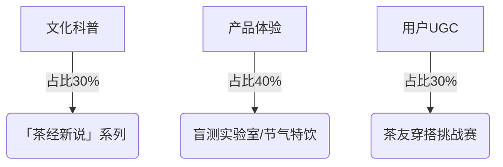

# COZE+deepseek，0-1赋能企业获客，全链路打通

**作者**：王笑东  
**公众号**：王笑东  
**发布时间**：2025年4月14日 10:58  
**原文链接**：https://mp.weixin.qq.com/s/PBbIOTOVLPMu4twBqwofmA

## 正文

最近agent产品越来越多了，而且是全面开花，可以用泛滥来形容了，我能感受到大家焦虑和迷茫的情绪。
我希望通过这篇文章，梳理一下思路，看能否为接下来AI商业落地提供一些灵感或方向。
我将以付费的形式开放我的这款产品，详情请到文末查看：

deepseek自媒体全链路运营工具：https://www.coze.cn/s/D2YJADf1B_0/

这款产品也迎来了重大更新，先看一下演示视频。
，时长
04:04
本篇文章分为以下三个部分：
一、产品体验流程；
二、为什么用AI做全业务流；
三、这款产品的后续发展。

下面开始

一、产品体验流程
这次，我把首页做成了如下这样，直接以自媒体运营全流程去呈现的。
为什么这么做？后面会写到。
先整个过程走一遍
以下流程仅为AI虚拟演示，不构成任何真实商业行为，特此说明。

我们以茶颜悦色为案例：
第一步IP人设定位生成：《小红书IP人设报告》
报告分为四个部分：小红书IP定位梳理、小红书起号地图策划、通过对标账号找爆款选题、通过关键词找爆款选题。
特别是最后两点，通过对标账号和关键词的分析，为用户找到爆款选题提供了路径。

一、小红书IP定位梳理：

一、项目概况：

1.项目介绍

茶颜悦色是一家专注于高品质、时尚与健康的茶饮品牌，融合中国传统文化元素与现代审美，打造独特的品牌形象。

2.项目优势

- 品牌文化内涵丰富，创新性强。

- 目标客户明确，聚焦15至35岁的年轻群体，尤其是女性消费者。

- 产品设计注重健康理念和文化主题包装。

3.项目目标

- 巩固市场地位，提升品牌忠诚度。

- 通过差异化竞争策略和文化创新，维持市场优势。

4.商业定位

4.1产品分析

- 主打“新中式鲜茶”，结合传统文化元素，强调健康养生、礼品功能和情绪调节等多重价值。

- 严格控制原材料质量，确保产品稳定出品。

4.2用户洞察

4.2.1用户画像

- 年龄：15至35岁，以90后为主。

- 性别：女性占比较高。

- 收入：中等偏高。

- 兴趣：追求美食、健康和时尚，对品牌文化有较高接受度。

4.2.2用户画像分析

- 年轻消费者对个性化、高品质生活方式需求强烈。

- 通过社交媒体和口碑营销与消费者建立深度互动。

二、账号定位：

1.变现策略

1.1变现模式

- 通过线上社区互动和社交媒体口碑营销提升品牌热度。

- 提供便捷的点单系统和会员服务增强顾客忠诚度。

1.2产品设计

- 结合中国传统文化元素，推出符合年轻消费者审美需求的产品。

- 注重健康养生、礼品功能和情绪调节等多重价值。

1.3产品优势

- 差异化产品定位，创新性强。

- 环保包装和节日主题礼盒提升购买体验。

1.4营销活动

- 结合咖啡与茶的融合产品，吸引消费者。

- 通过线上预约代购功能满足多样化需求。

2.人设定位

2.1任务分析

- 品牌IP，符合品牌调性。

- 与年轻人打成一片，增强互动性。

2.2出镜分析

- 通过社交媒体平台（如微博）加强与消费者的沟通。

3.内容定位

3.1内容方向

- 强调品牌文化内涵和创新性。

- 展示产品健康理念和文化主题包装。

3.2对标账号分析、对标账号搜索关键词

- 对标账号：霸王茶姬等新式茶饮品牌。

- 搜索关键词：新中式鲜茶、健康茶饮、中国风茶饮。

3.3热门选题关键词

- 茶饮文化、健康生活方式、节日主题包装。

三、账号策划

1.矩阵规划

- 主账号：茶颜悦色官方账号，展示品牌文化和产品。

- 子账号：聚焦不同产品线或主题活动。

2.内容形式

- 图文内容：展示产品设计和品牌故事。

- 短视频：记录制作过程和消费者体验。

3.发布规划

- 每周发布3-5条内容，涵盖产品介绍、用户反馈和品牌活动。


二、小红书起号地图策划：

### 小红书人设打造方案：茶颜悦色品牌IP账号


#### 一、人设定位分析

1. **核心优势提炼**

   - **文化基因**：新中式茶饮+国潮美学

   - **健康主张**：0反式脂肪酸/天然原料

   - **情绪价值**：治愈系「第三空间」体验

2. **目标受众画像**

   ```mermaid
   pie
       title 核心用户画像
       "18-28岁女性" : 65%
       "Z世代学生党" : 25%
       "都市轻熟女" : 10%
   ```

3. **差异化定位**

   「传统文化解构者」×「年轻化茶饮布道官」
   *用赛博朋克的方式讲中国茶故事*

#### 二、视觉识别系统

1. **昵称方案**

   - 主推款：@茶颜悦色国风实验室

   - 备选款：@茶颜の节气研究所 / @悦小茶の暗号

2. **头像设计**

   - 方案A：品牌LOGO+动态水墨特效

   - 方案B：Q版古风人物手持奶茶（参考故宫文创风格）

3. **个性简介模板**

   "✨新中式鲜茶首席体验官 | 每周三/五解锁隐藏菜单  
   🍵用年轻的方式喝懂中国茶 | 后台回复「暗号」抽限定周边  
   #茶饮界的文化复兴运动 #这届年轻人养生玄学"

#### 三、内容战略地图

**黄金内容三角模型**：



**爆款选题示例**：

1. **知识类**

《红楼梦里的下午茶，用奶茶复刻是什么体验？》
*结合十二金钗人设做产品拟人化*

2. **互动类**

「暗号点单」解密：对着店员说"要一杯云鬓花颜"会发生什么？
*制造品牌独家梗文化*

3. **场景类**

测评：用茶颜悦色24节气杯插花，哪个系列最出片？
*强化包装的二次利用价值*

#### 四、运营执行手册

1. **发布节奏**

   - 固定栏目：
     ▫️每周三「新品剧透日」
     ▫️每周五「茶友神仙喝法」
   - 热点借势：提前储备24节气/传统节日内容包

2. **互动四步法**：

   ① 评论区埋梗："猜猜下期隐藏菜单用哪款茶叶？"
   ② 私信自动回复设置品牌冷知识问答
   ③ 每月举办「茶颜方言挑战赛」
   ④ 建立「悦色雅集」粉丝群实行等级勋章体系

3. **视觉规范**：

   - 字体：汉仪尚巍手书体+阿里巴巴普惠体
   - 色板：黛蓝(#2A2936)+妃红(#ED6E72)+月白(#F8F4E9)
   - 构图：留白30%+中式窗棂框型

#### 五、风险控制

1. **内容红线**：

   - 避免直接功效宣称（如"减肥"等敏感词）
   - UGC内容需明显标注"个人体验非专业建议"

2. **舆情应对**：

   建立「茶颜辞典」话术库应对：
   ▫️价格质疑→换算为"单杯=2颗草莓维生素含量"
   ▫️排队吐槽→发起"云排队"直播缓解焦虑

建议初期采用「3+1+1」内容测试法：
3条产品内容+1条文化深度+1条粉丝互动，通过两周数据监测优化选题方向。可重点开发"新中式茶饮搭配"场景内容，这是目前平台搜索量年增长187%的蓝海领域。

三、通过对标账号找到爆款选题的方法：
进入新榜网站，根据小红书对标账号特征、搜索方法：【小红书对标账号特征、搜索方法：
1. 对标账号特征：
   - 新中式茶饮品牌，如霸王茶姬等。
   - 强调健康、文化内涵和创新性。
   - 目标用户为15-35岁年轻女性，注重时尚和健康生活方式。
2. 搜索方法：
   - 使用关键词：新中式鲜茶、健康茶饮、中国风茶饮、国潮茶饮、茶饮文化。
   - 关注相关话题标签，如#茶饮界的文化复兴运动#、#这届年轻人养生玄学#。
   - 搜索热门笔记，分析高互动内容。】，在【低粉爆款】中找到优质作品：互动总数高，而粉丝数低的作品。
https://www.newrank.cn/hotInfo?l=sq_main-t_xgj_rmnr

接下来您有两个选择：
1、可以将该优质作品链接复制，直接通过【一键创作】，进行仿写。
2、可以打开该优质作品的作者主页，复制链接，提取作者ID（比如：https://www.xiaohongshu.com/user/profile/639a8aaa000000002801a91f?xsec_token=ABHAgJYu0bLEqtprEBSvrq2jAS-kZFUqCuOfXgzvb3iec=&xsec_source=pc_feed。其中639a8aaa000000002801a91f这一串数字就是作者ID）
然后进入【对标账号】页面，填入作者ID并提交，生成对标账号分析报告，从中找到爆款选题，进行仿写。

四、通过对标关键词找到爆款选题的方法：
复制对标关键词：小红书热门选题关键词：
1. 茶饮文化：新中式茶饮、中国风茶饮、茶经新说、传统文化解构。
2. 健康生活方式：0反式脂肪酸、天然原料、健康茶饮、养生玄学。
3. 节日主题包装：24节气杯、节日主题礼盒、国潮美学、二次利用价值。
4. 互动内容：暗号点单、茶友神仙喝法、盲测实验室、茶友穿搭挑战赛。
5. 场景内容：新中式茶饮搭配、治愈系第三空间、红楼梦下午茶、云排队直播。。进入【对标关键词】页面，填入关键词并提交，生成对标关键词分析报告，从中找到爆款选题，进行仿写。

第二步、第三步对标拆解+爆款选题：
借助上一步提供的方法，找到对标账号（霸王茶姬），通过拆解对标账号/拆解关键词来提取选题相关信息（到飞书多维表格），并生成分析报告。
报告中为用户找到明确的爆款选题，并给出理由。
可以看到下面的分析报告分为了三个部分：
一、关于对标账号的整体分析，包含市场定位分析，用户画像分析，账号数据分析，可学习的地方和还需提升的地方，多个维度去分析对标账号。
二、关于对标账号作品的数据分析，所有作品数据对比分析，点赞数与收藏数分析等，从中找出表现突出的作品，并简要的分析。
三、结合用户自己账号定位，从所有作品中找出一个爆款，并写明理由。
最后选出的是这个：
🎁抽50套｜预售正式开启，周边实物抢先看！
🍵以东方，会世界！
👋茶友们下午好
#霸王茶姬哪吒2联名 新周边拍了拍你~
吒儿即将和大家见面啦！请先看看姬姐准备的美图吧~
霸王茶姬以茶会友，在这个春天，邀茶友们一起喝杯茶，把快乐加满！
🎁「全套联名主题周边」*1份，内含：
🔴以东方•会世界全套吧唧（共3组，6枚）
🔵以东方•会世界 全套冰箱贴（共3枚）
🔴以东方•会世界 水墨风角色海报（共6张）
🔵会友主题杯（共2款）及同款主题纸袋（1个）&主题镭射吊牌（1张）
-
✨抽奖人数：50人
⏰开奖时间：4月11日 15:00
✨参与方式：点击封面下方
#霸王茶姬哪吒2联名 #以东方会世界
#霸王茶姬 #天然好茶以诚会友
#CHAGEETOGETHER

而且分析的非常到位，有兴趣的同学可以拉到报告底部看一下。

小红书对标账号CHAGEE霸王茶姬的分析报告

### 一、关于对标账号的整体分析

#### 市场定位分析

“CHAGEE 霸王茶姬”定位为现代东方茶品牌，以东方茶会世界友，致力于将东方茶推向全球。通过与电影《哪吒之魔童闹海》等 IP 联名，打造具有文化特色的茶饮周边，吸引消费者。这种定位既结合了传统文化元素，又满足了当下消费者对新奇、独特消费体验的追求，在茶饮市场中形成差异化竞争。

#### 用户画像分析

从账号作品的互动情况来看，其用户群体可能主要是喜欢茶饮、对传统文化感兴趣的人群。年龄范围可能较广，但以年轻人为主，他们更愿意尝试新鲜事物，对品牌联名活动有较高的参与热情。可能包括学生群体和年轻上班族，注重消费的仪式感和文化内涵。

#### 账号数据分析

1. **账号粉丝量**：

已知喜欢数为 1882241，收藏数为 360845，则点赞 + 收藏总数为 (1882241 + 360845 = 2243086)，粉丝数为 729018。

粉丝转化比例为 (2243086÷729018≈3.08)，即 1:3.08，远远高于 1:10 的标准，说明该账号的粉丝转化效果非常好，值得参考。

2. **点赞数：收藏数**：

整体上，账号的点赞数（1882241）远高于收藏数（360845），说明大部分内容可能更偏向娱乐性或即时性消费，能满足用户当下的爽点，但收藏价值相对较低。不过，部分作品如“🎁再抽 50 套！(内附联名周边超详细兑换攻略)”收藏数和点赞数差距相对较小，这类作品可能具有较高的实用性和收藏价值。

#### 可学习的地方

1. **IP 联名策略**：与热门电影 IP 联名，能快速吸引大量关注，提高品牌知名度和产品销量。联名活动不仅推出了周边产品，还围绕联名开展了一系列预售、兑换、抽奖等活动，增加了用户的参与度和粘性。

2. **粉丝转化能力**：账号出色的粉丝转化效果表明其内容和运营策略能够有效吸引用户成为粉丝。可以学习其内容策划、互动方式等方面的经验，提高自身账号的粉丝转化能力。

3. **活动营销**：通过举办惊喜盒子掉落、线上集卡等活动，激发用户的参与热情，提高作品的互动量和传播度。

#### 还需提升的地方

虽然整体点赞数较高，但部分作品的点赞数和收藏数差距较大，说明部分内容的收藏价值有待提高。可以在内容创作上更加注重实用性和知识性，为用户提供更多有价值的信息，提高作品的收藏率。

### 二、关于对标账号作品的数据分析

#### 作品互动数据对比

|作品名称|作品喜欢数|作品收藏数|作品评论数|作品分享数|
| --- | --- | --- | --- | --- |
|霸王茶姬×电影《哪吒之魔童闹海》明天见!|19501|4577|9126|9670|
|霸王茶姬哪吒 2 联名周边今日全国门店售卖！|53|14|56|9|
|🙌姬姐已抵达印度尼西亚！|93|8|28|11|
|📢以诚会友｜联名预售套餐兑换机制调整！|201|41|403|119|
|以诚会友，集卡有礼🎁|118|35|242|17|
|🎁再抽 50 套！(内附联名周边超详细兑换攻略)|1722|1221|1138|317|
|📢以东方会世界｜联名周边套餐攻略|305|68|158|125|
|电影《哪吒之魔童闹海》联名新皮肤即将上线！|1574|331|481|925|
|📍连续 3 天！直播攻略看这里！|90|19|87|9|
|电影《哪吒之魔童闹海》联名预售倒计时 2天！|728|134|116|69|
|CHAGEE NEW 青年艺术计划 Vol.1｜评选结果揭晓|67|16|27|8|
|姬姐朋友圈分享➕1|168|33|173|9|
|👀让我看看大家的假期安排！|587|94|324|11|
|快快码住｜联名预售券包饮品券兑换攻略来啦|485|114|191|36|
|🌷一起喝杯春日好茶，给假期充充电！|376|73|164|9|
|🪂惊喜盒子降落中｜一起以东方会世界！|8717|2405|8667|279|
|清明｜清风明月，以茶寄思|157|32|117|8|
|以诚会友｜联名预售套餐饮品券核销范围调整|645|112|614|133|
|以东方，会世界！4 月 3 日正式上线|1914|381|486|910|
|🎁抽 50 套｜预售正式开启，周边实物抢先看！|5390|3415|4143|910|
|联名周边如何获得？谁还不知道！|1906|459|966|103|

从数据可以看出，与联名活动相关的作品互动量普遍较高，尤其是涉及周边预售、抽奖、攻略等内容的作品。例如“🎁抽 50 套｜预售正式开启，周边实物抢先看！”和“🪂惊喜盒子降落中｜一起以东方会世界！”，喜欢数、评论数和分享数都非常可观。而一些日常分享或活动结果公布类的作品互动量相对较低。

#### 点赞数与收藏数分析

大部分作品的点赞数高于收藏数，但也有部分作品如“🎁再抽 50 套！(内附联名周边超详细兑换攻略)”收藏数和点赞数差距较小，说明这类包含实用信息的作品更受用户青睐，具有较高的收藏价值。

### 三、结合用户自己的账号定位，从这些作品中找出一个最适合、最容易生成爆款的作品去仿写，并写明理由

#### 仿写作品

作品名称：🎁抽 50 套｜茶颜悦色联名周边预售正式开启，实物抢先看！

作品 id：无（假设为仿写新作品）

#### 理由

1. **与自身定位契合**：茶颜悦色和霸王茶姬都是茶饮品牌，且都注重品牌文化和产品的创新性。借鉴霸王茶姬的联名周边预售活动，茶颜悦色可以结合自身品牌特色和热门 IP 进行联名，推出具有吸引力的周边产品，符合自身品牌定位。

2. **数据支持**：“🎁抽 50 套｜预售正式开启，周边实物抢先看！”这一作品在对标账号中取得了非常高的互动量，喜欢数 5390、收藏数 3415、评论数 4143、分享数 910。说明此类联名周边预售且带有抽奖活动的内容能够吸引用户的关注和参与，容易引发用户的分享和讨论，有较大的潜力成为爆款。

3. **目标用户一致**：茶颜悦色的目标客户是 15 至 35 岁的年轻群体，尤其是女性消费者，与霸王茶姬账号吸引的用户群体有较大重合度。这类联名活动能够满足年轻消费者对新奇、独特消费体验的追求，符合目标用户的兴趣和需求。

第四步引流获客：根据爆款选题，进行二创，生成小红书文案+配图+视频。
二创文案+配图如下：
两个视频如下：
，时长
00:22
，时长
00:28
整体效果还不错，现实中肯定还有很多细节需要去优化调整。
但是对于中小企业或个人来说，已经够用了，如果能在此基础上加上一些私有化的数据（产品里面企业知识库和定制提示词，可以让用户达到这一目的）。
从上面的过程来看不知道大家有没有意识到一个问题，我们做自媒体的目的是为了获客，为了成交。
但是这个过程并不是只有最后一步的创作文案、拍摄、制作视频，其实这是一个系统工程。
这最后一步里面包含着对我们自己品牌的理解，对竞争对手的洞悉，对用户价值的体感，对平台规则的了解，对运营工作的理解等等。
所以其实获客、成交是一整个链条里面的最后一两环。
这整个链条是长且深的，说白了我们需要对这个复杂的事情，拆分成一段一段的相对简单的事情，所有环节都做到位了，最后的结果自然就会呈现出来。
我们只要把这个链条总结出来交给AI，AI就能以比较平均的水平去完成，这样与其逼它在某一个环节达到90分，不如让它在所有环节达到60-70分，这样的帮助可能还会更大一些。
以上也是我认为的为什么要用AI做全业务链的一个原因，下面还会讲到另一个原因。

二、为什么要用AI做全业务流
现在市面上AI商业应用大多数是以流量获客为主，但是效果普遍不佳，总感觉生成的文案或海报和自己想要的差距甚远。
其实原因是，大家逐渐的忽略了底层提示词的作用了。
去年2024年，提示词绝对是一个热词，但是25年之后，提示词的热度明显降下来了。大家更加的关注coze、deepseek、manus上去了。
而提示词的使用，就意味着AI需要做到全业务流，我们一个一个的讲
1、提示词的原理
我们还是回归底层原理，大家应该听过一个比喻（我之前的文章里面也提到过），说我们面对AI就像面对一个刚刚毕业的985大学毕业的实习生。
我们需要知道如何对他（AI）下命令，这就是提示词的底层原理。
这个需要我们清晰的认识自己和学会如何与别人有效沟通。
这里我们用由美国心理学家乔瑟夫和哈里提出乔哈里视窗原理来进一步分析了。
这个原理说的是，我们与对方（AI）沟通的时候（也就是写提示词），分为了四种情况：
第一种是所谓的公开区，我们自己知道，对方（AI）也知道的情况，对于AI来说就是一些公共数据部分。
比如当你让它写小红书文案的时候，你不需要向它解释小红书是干什么的，小红书平台运行机制什么的，因为这些内容网上都有。
这一部分，你就只需要一句话告诉它就行了。
第二种是所谓的盲区，就是对方（AI）知道，而自己不知道的情况。
在这里，我们将AI当成了升级版的百度，它能够迅速的在网上搜集所有相关信息，并结构化的呈现给我们。省却了我们大量的时间。
比如，我通过三个问题，找到了适合我的小红书变现途径，以及具体的路径和策略，但这不是我规划出来的，而更像是AI帮我在前面探路，而我去做选择：
这一部分，往往是发散的，你也不知道AI会把你带到哪里去。这一部分能开拓视野，提供灵感。但是往往不能直接落地执行。
第三种就是所谓的隐藏区，就是自己知道，而对方（AI）不知道的情况。
在什么情况下，我们希望把我们知道而AI不知道的事情告诉它呢？就是希望AI给我们干活的情况嘛。
当我们让AI帮我们写一篇小红书文案的时候，我们其实是希望说清楚的，但是往往不知道从哪里说起和说什么。
所以网上最开始把写提示词的人称为魔法师，把写提示词称为念咒语。因为有的咒语出来的效果就是很厉害。
但是不论别人写得再好，往往都不适合你，因为这不是你或你所在企业的真实想法和真实目的。这个咒语（提示词）还是需要我们自己做。
那么这个提示词要怎么写呢？
我们想象一下，如果你招了一个实习生，让他做自媒体运营工作，你要怎么带他呢？
你是不是要告诉他，关于公司的一些情况，为什么需要做自媒体，宣传推广的目的是什么？产品是什么？用户都是谁？
这不就是企业的品牌定位相关信息嘛。
你是不是还需要告诉他，现在做自媒体和之前不同了，需要找到精准对标，去分析、拆解对标账号，从中找出能获取流量的策略以及选题。
这不就是拆解对标和爆款选题嘛。
你是不是还需要告诉他，我们的获客文案风格是什么样的，哪些优质文案是可以模仿的，需要建立素材库。
这不就是企业知识库和定制提示词嘛。
总之，就是让他（AI）全程参与，在过程中所获得私有化数据（就是我们知道，而AI不知道的）。获取的越多越精准，那么这位员工（AI）的经验就越足，自然就会越干越好。
上面这个图就是我这款产品的底层逻辑了，AI全程参与，全程获取数据，最后完成公域引流和私域成交的目的。

现在这款产品中，有两块是植入到提示词中去的
一个是IP人设里面【项目概况】部分。
以刚才案例为例。

一、项目概况：
1.项目介绍
茶颜悦色是一家专注于高品质、时尚与健康的茶饮品牌，融合中国传统文化元素与现代审美，打造独特的品牌形象。
2.项目优势
- 品牌文化内涵丰富，创新性强。
- 目标客户明确，聚焦15至35岁的年轻群体，尤其是女性消费者。
- 产品设计注重健康理念和文化主题包装。
3.项目目标
- 巩固市场地位，提升品牌忠诚度。
- 通过差异化竞争策略和文化创新，维持市场优势。
4.商业定位
4.1产品分析
- 主打“新中式鲜茶”，结合传统文化元素，强调健康养生、礼品功能和情绪调节等多重价值。
- 严格控制原材料质量，确保产品稳定出品。
4.2用户洞察
4.2.1用户画像
- 年龄：15至35岁，以90后为主。
- 性别：女性占比较高。
- 收入：中等偏高。
- 兴趣：追求美食、健康和时尚，对品牌文化有较高接受度。
4.2.2用户画像分析
- 年轻消费者对个性化、高品质生活方式需求强烈。
- 通过社交媒体和口碑营销与消费者建立深度互动。

二是企业知识库部分。
在【拆解对标账号】和【拆解关键词】板块可以一键导入。
或者在【企业知识库板块】，手动导入
然后在提示词中，以【案例】的形式植入。会根据文案的主题先在知识库中查找。

三、这款产品的后续发展
这款产品在制作的过程中，我的思路不断的在发生变化，各个工作流之间的连接，各种数据库的搭建，各种变量的使用，升级迭代了很多次，也逐渐的成熟了起来。
在这个过程中，我的制作技巧不断的提高，自媒体运营思路也逐渐的清晰了很多。
我觉得这款产品能带来两个方面的价值：
一是对于COZE搭建AI应用或智能体的理解和搭建技巧是有很大帮助的。
在有了思路的情况下，如何用COZE去实现它，中间其实是有很多卡点的，你需要找资料，不断的犯错，不断的反思，一个卡点一个卡点的去解决。
无形中，你对COZE的理解已经很深了，而动手能力也同步在提高，基本上能解决99%的问题了。
比如我之前为了解决有的用户觉得飞书多维表格配置麻烦的问题，还专门做了一个普通版，就是不需要配置飞书多维表格。后来我是通过加一个开关，很容易的就解决了这个问题。
这款产品的制作也基本上摸到了COZE制作AI应用的上限。为什么这么说
我发现COZE制作AI应用最多只允许创建20个页面，但是我有办法创建多于20个页面。
另外就是我发现，工作流不能超过50个，超过50个系统就会提示错误。所以这款产品的工作流卡在了50个以下。
另外，我还将这个AI产品，拆分成了20个智能体，如果是初学者的话，通过这20个智能体可以很快的上手。
二是这款产品我觉得能为AI的商业落地提供一种可能性和一个框架。
我在与朋友交流的过程中，发现了一个现象，就是现在AI应用难以落地还有一个原因，就是很多人对于业务的理解不深，再加上对于AI应用的理解不深，这就导致很难上手使用。
如果AI应用与培训相结合，就能完美的解决这个问题。
在培训业务的过程中，用AI来辅助实现，既加深了对业务的理解，也加深了对AI应用的理解。
在企业中落地AI应用也是同样的问题，如果AI应用就是按照企业实际流程运行的，那么落地就简单多了。

最后
我将这个产品的完整工作流、用户界面搭建以付费的形式开放团队空间，售价499元。
知识星球老会员只需再付100元。
有意向的同学添加我的微信：wangxiaodong17ai，备注499，或者直接打赏，我会联系你。
除了加入团队空间之外，还有如下权益：
1、deepseek自媒体全链路运营工具全部工作流、用户界面搭建；
这款AI产品介绍及主要工作流说明。
https://zrstx1ebls.feishu.cn/docx/QDosd4YYgoVgnixe9Wrcuhmfn2f
2、20个拆解之后的智能体，囊括了所有功能，便于上手学习；
3、免费加入我的知识星球空间，加入会员群。
可以加入我之前制作AI智能体及应用空间。更多会员权益请查看：

https://zrstx1ebls.feishu.cn/docx/TRRgdktfmoqg7oxmMKNccmdynlb
4、我使用的提示词汇总及各行业高质量提示词集合
5、COZE工作流搭建视频资料。

往期内容：
COZE+Deepseek v3，生成小红书/小绿书配图卡片，一键生成短视频（4种模式）
COZE+deepseek自媒体辅助工具：灵感+拆解+提取+收藏+飞书多维表格+创作
COZE+deepseek=AI产品，人人都能创作优质短篇故事
用COZE制作自媒体全流程应用，拆解文章+数据分析+素材提取+导入飞书表格+知识库+仿写+播客

欢迎点赞、转发、在看给我鼓励

如果觉得本文有用请

👇👇关注我👇👇

题图标题：《山花烂漫》
AI算法提供：FLUX，
An aerial view of 3D Chinese characters 'chūn tiān' composed of blooming pink tulips,surrounded by endless fields of blooming pink-and-white gradient tulips,vibrant green hills full of wildflowers,meandering blue rivers reflecting cotton-like clouds,swarms of colorful butterflies in motion blur,morning mist softens distant snow-capped mountains,retro windmills in golden sunlight,drone view,ultra-wide-angle lens distortion,8k resolution,individual petals and water droplets can be seen. Soft bokeh of dandelion seeds in the foreground,cinematic lighting with light penetrating clouds,soft color palette with prism light effects,popular on ArtStation,composed in the style of Andreas Rocha and James Gilleard,big scene.,
